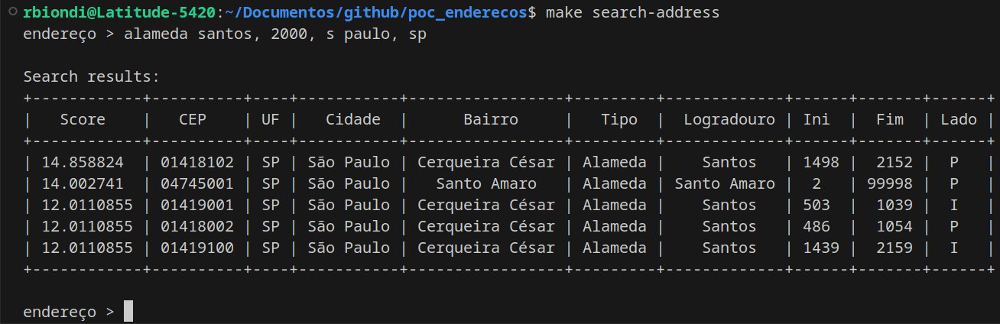

# address_matching

This is a proof of concept using libpostal machine learning library + opensearch to match any address provided (in Brazil) by the user.

## Instructions

### Prereqs

```
# install psycopg2 pre-reqs
sudo apt install python3-dev libpq-dev 
```

### Build service containers

```
make build-pg
```

### Starting services

```
make infra-start
```

### Setting up libraries

```
make setup
```

### Creating Opensearch Index

```
make create-index
```

### Create Database schemas

- Run the scripts bellow against pg database to create the `correios` database and schema: `sql/correios-schema.sql`

### Import Correios data files

- Put the EBCT files in the following directory `data/correios`, for example `LOG_BAIRRO.TXT`, `LOG_LOGRADOURO_SP.TXT` and so on...

- Run the importer script:

```
make import-correios-files
```

### Import data into Opensearch

- Run the importer script (it may take several hours to populate):

```
make import-opensearch
```

## Testing

- Execute the search tool:

```
make search-address
```

The address with the higher score will be the matching.

[]